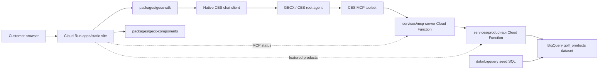

# Architecture And Data Flow Spec

## Summary

The canonical deployed flow is:

website -> GECX/CES root agent -> MCP toolset -> MCP Cloud Function -> product
REST API Cloud Function -> BigQuery views.

The static website also calls the product API and MCP endpoint directly for page
rendering and status display. Those direct browser calls support the storefront
experience, but the conversational tool path for deployed GECX is the MCP
toolset attached by Terraform.

Terraform deploys the website itself to Cloud Run. Cloud Run serves the Vinext
server/client build and injects the runtime environment variables that point to
the deployed Product API, MCP endpoint, and CES WEB_UI deployment.

## Diagram

## Website To GECX

`apps/static-site/app/page.tsx` builds the runtime config from these variables:

- `VITE_PRODUCT_API_URL`
- `VITE_MCP_SERVER_URL`
- `VITE_GECX_ENABLE_WIDGET`
- `VITE_GECX_PROJECT_ID`
- `VITE_GECX_LOCATION`
- `VITE_GECX_APP_ID`
- `VITE_GECX_DEPLOYMENT_ID`
- `VITE_GECX_AGENT_ID`
- `VITE_GECX_LANGUAGE_CODE`
- `VITE_GECX_CHAT_TITLE`

`apps/static-site/app/storefront-experience.tsx` mounts the native CES chat when
the widget is enabled and project, location, app ID, deployment ID, and agent ID
are present. The SDK generates a public chat token for the CES WEB_UI
deployment, then calls `runSession` for each user message.

## GECX To MCP

Terraform creates the MCP toolset with:

- resource: `google_ces_toolset.golf_store_mcp`
- output: `mcp_toolset_name`
- server address: deployed MCP function URL plus `/mcp/`

The root agent resource `google_ces_agent.golf_store_assistant` attaches this
toolset. This is the primary deployed path for BigQuery-backed catalog and
purchase-support answers.

Direct Python tools are also provisioned by Terraform from `gecx/tools/python`,
but the root agent is configured to use the MCP toolset by default. Treat
`gecx/tools/python`, `gecx/tools/definitions`, and `gecx/evaluations` as
demo/reference assets unless the deployed agent is changed to use them directly.

## MCP To Product API

The MCP server accepts JSON-RPC over HTTP at `/mcp`. It supports:

- `initialize`
- `tools/list`
- `tools/call`

For `tools/call`, `services/mcp-server/main.py` maps tool names to product API
endpoints:

- `search_products` -> `GET /products`
- `get_product_details` -> `GET /products/{product_id}`
- `compare_products` -> `POST /compare`
- `get_category_margin_summary` -> `GET /categories`
- `get_low_stock_best_sellers` -> `GET /low-stock`
- `get_financing_options` -> `GET /financing`
- `get_card_offers` -> `GET /card-offers`
- `get_installment_plans` -> `GET /installment-plans`
- `get_loyalty_program_details` -> `GET /loyalty`
- `get_active_promotions` -> `GET /promotions`
- `get_shipping_info` -> `GET /shipping`
- `get_returns_policy` -> `GET /returns`
- `get_warranty_info` -> `GET /warranties`
- `get_checkout_guidance` -> `GET /checkout-guidance`
- `estimate_cart` -> `POST /cart/estimate`

The MCP function reads:

- `PRODUCT_API_BASE_URL`
- `PRODUCT_API_AUDIENCE`
- `PRODUCT_API_AUTH_MODE`
- `ALLOWED_ORIGINS`

When `PRODUCT_API_AUTH_MODE=google_id_token`, the MCP runtime obtains a Google
ID token for `PRODUCT_API_AUDIENCE` and sends it as a bearer token to the
product API.

## Product API To BigQuery

The product API reads:

- `BIGQUERY_PROJECT`
- `BIGQUERY_DATASET`
- `ALLOWED_ORIGINS`

It queries these main views:

- `vw_product_catalog_current`
- `vw_product_listing_current`
- `vw_product_detail_current`
- `vw_product_facets`
- `vw_category_navigation`
- `vw_cart_pricing_current`
- `vw_category_margin_summary`
- `vw_low_stock_best_sellers`
- `vw_active_financing_options`
- `vw_loyalty_benefits`
- `vw_active_promotions`
- `vw_purchase_support_policies`
- `vw_checkout_support`

The seed file creates supporting dimensions and facts for brands, suppliers,
categories, products, variants, reviews, inventory, price history, sales,
performance, payment methods, card offers, installment plans, loyalty,
promotions, shipping, returns, warranties, and checkout guidance.

## Observability And Export

The product catalog dataset is not the same thing as Dialogflow conversation
history export. If conversation export is enabled, document the destination
dataset/table separately and confirm the Dialogflow service account has the
required BigQuery permissions.
